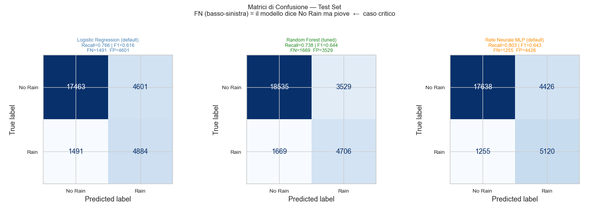
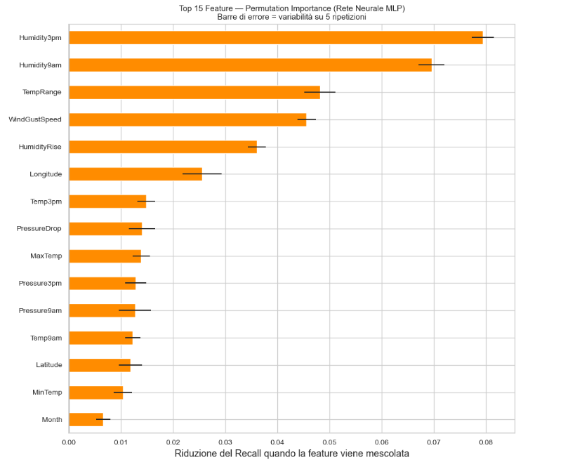
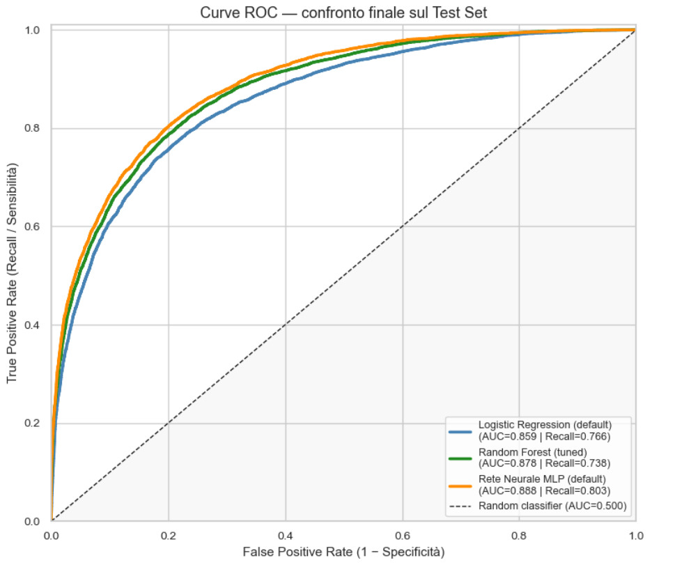

# Previsione delle Precipitazioni in Australia

Portfolio page: https://matteomontisci03.github.io

## Project Overview
Il progetto affronta un problema di classificazione binaria con l'obiettivo di prevedere se il giorno successivo pioverà in una data località australiana. In un'ottica di business agricolo, il modello mira a minimizzare i Falsi Negativi (mancata allerta pioggia), focalizzando l'ottimizzazione degli algoritmi sulla massimizzazione della metrica Recall.

## Dataset
I dati utilizzati provengono dall'Australian Bureau of Meteorology e comprendono circa 145.000 osservazioni meteorologiche giornaliere. La variabile target è `RainTomorrow` (Sì/No), la quale presenta un forte sbilanciamento delle classi (circa 78% negative, 22% positive).

## Workflow
* **Data loading e pulizia:** Rimozione delle variabili con oltre il 38% di valori mancanti.
* **Feature engineering:** Creazione di indicatori dinamici (es. `PressureDrop`, `HumidityRise`) ed encoding spaziale/circolare (Latitudine/Longitudine, direzioni del vento trasformate in seno/coseno).
* **Addestramento e valutazione:** Prevenzione rigorosa del Data Leakage tramite split stratificato (60% Train, 20% Val, 20% Test) con imputazione mediana e standardizzazione calcolate ed applicate unicamente sul Training Set.

## Models Used
Sono stati addestrati e confrontati i seguenti modelli:
* Logistic Regression
* Random Forest
* Rete Neurale (MLP)

## Results
Di seguito le prestazioni finali calcolate sul Test Set (dati non visti):

| Metric | Logistic Regression | Random Forest | Rete Neurale (MLP) |
|---|---:|---:|---:|
| Accuracy | 0.78 | 0.81 | 0.80 |
| Precision | 0.51 | 0.57 | 0.53 |
| Recall | 0.76 | 0.73 | 0.80 |
| F1-score | 0.61 | 0.64 | 0.64 |

## Key Insights
Il modello vincitore (Rete Neurale) raggiunge buona accuratezza, ma il recall all'80.3% è importante se vogliamo identificare più casi positivi possibili al fine di diramare allerte meteo tempestive. Dalla feature importance è emerso inolte che l'umidità pomeridiana, le raffiche di vento e le nostre feature derivate sul calo di pressione e sull'escursione sono gli indicatori fisici più determinanti per l'algoritmo. Confrontando gli altri approcci, la Regressione Logistica si conferma preziosa per la sua totale interpretabilità, mentre il Random Forest ha fornito il compromesso più bilanciato (miglior F1-score), mitigando efficacemente la forte tendenza all'overfitting riscontrata nel singolo Albero Decisionale.
